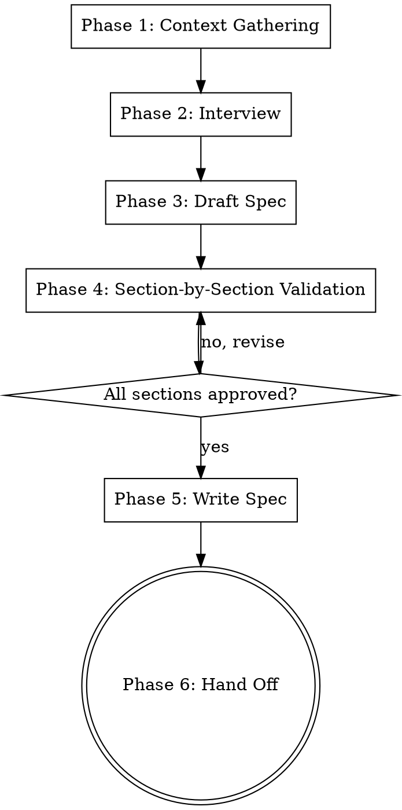

# Project Interview

Gather project requirements through structured interviews and produce a validated, phased specification with acceptance criteria and verification protocols per phase.

## Workflow



## Phase 1: Context Gathering

Check existing project state before asking questions.

- Look for existing `*-spec.md` in the project root
- If found: read it and explore the codebase with sub-agents to understand current state
- If not found: note this is a greenfield interview
- Check `CLAUDE.md`, `pyproject.toml`, `package.json` to auto-detect tech stack

**Exit criteria:** Summary of what exists or confirmation of greenfield.

## Phase 2: Interview

Use `AskUserQuestion` to conduct the interview. One question at a time. Cover these topics as relevant:

- Project vision and goals
- Tech stack and technical implementation
- Testing strategy (unit, integration, e2e, coverage goals)
- Security requirements and concerns
- Cloud services and infrastructure
- Scalability considerations
- UI/UX requirements
- Tradeoffs and constraints
- Ticket/branch prefix for commit checkpoints (e.g., `AIP-123`)

### Question Quality

- Not answerable by reading the codebase
- Specific and in-depth
- Building on previous answers

### Architectural Decisions

When the interview surfaces a decision point (tech stack choice, database, auth strategy, API design, etc.):

1. Research the options using WebSearch/WebFetch
2. Propose 2-3 approaches with trade-offs
3. Lead with your recommendation and explain why
4. Let the user decide before moving on

### Research-Driven Recommendations

When discussing best practices, strategies, frameworks, libraries, or tools:

1. **Use WebSearch and WebFetch** — do not rely solely on internal knowledge
2. **Validate before recommending** — search for current community recommendations, known issues, and alternatives
3. **Stay current** — prioritize recent articles, documentation, and discussions
4. **Present evidence** — share findings and sources when multiple valid approaches exist

| User Question                       | Research Action                            |
| ----------------------------------- | ------------------------------------------ |
| "What library should we use for X?" | Search for current comparisons             |
| "How should we structure the API?"  | Research best practices for the tech stack |
| "What's the best approach for X?"   | Find recent community discussions          |
| "Should we use X or Y?"             | Search for up-to-date comparisons          |

**Exit criteria:** All relevant topics covered, enough information to draft a complete spec.

## Phase 3: Draft Spec

Assemble the complete spec as a phased TDD implementation plan. Each phase uses this template:

```markdown
## Phase N: <description>

### Requirements

- What this phase delivers

### Tests (write first — TDD)

- Specific test cases defining expected behavior

### Implementation

- Code to write to make tests pass

### Acceptance Criteria

- [ ] All tests pass
- <specific measurable criterion>
- <specific measurable criterion>

### Verification Protocol (must pass before commit)

1. **Tests:** Use `verification-before-completion` skill — run test suite, read full output, confirm pass + coverage target with evidence
2. **Code Review:** Use `requesting-code-review` skill to dispatch code-reviewer against this phase's requirements and acceptance criteria
3. **Commit** only after both steps above pass: `TICKET-123: <descriptive message>`
```

### Phase Rules

- Each phase is a single, atomic committable unit
- Each phase leaves the codebase in a GREEN, WORKING state (all tests pass, no broken functionality)
- Phases build incrementally on each other
- Prefer smaller commits over larger ones — if a phase feels too big, split it

### TDD Structure (per phase)

**REQUIRED:** Use `test-driven-development` skill for each phase:

1. Write failing tests first that define expected behavior
2. Implement the minimum code to make tests pass
3. Refactor while keeping tests green
4. Each phase includes both test and implementation code

**Exit criteria:** Complete draft with all phases, each having acceptance criteria and verification steps.

## Phase 4: Section-by-Section Validation

<HARD-GATE>
Do NOT write the spec file until every section has been individually validated by the user.
</HARD-GATE>

Present the draft to the user one section at a time:

1. Present the overview/architecture section — ask for approval
2. For each phase, present **all** of the following:
   - Requirements, tests, acceptance criteria, and verification protocol
   - **Files that will be created or modified** (full paths)
   - **Code snippets** showing key changes: function signatures, data models, route definitions, schema changes, config additions — enough to understand _what_ will change, not just _that_ it will change
   - **Dependencies** added or removed (packages, services)
   - Ask: "Does this phase accurately capture the requirements? Any changes needed?"
   - If changes requested: revise and re-present that section
   - If approved: move to next phase
3. After all phases approved, present a final summary view

### Validation Checks

- **Completeness:** Does each phase cover what was discussed?
- **Consistency:** Do phases build on each other correctly?
- **Feasibility:** Are acceptance criteria measurable and achievable?
- **Ordering:** Are dependencies between phases correct?

**Exit criteria:** Every section approved by the user.

## Phase 5: Write Validated Spec

After all sections are validated:

1. Write the complete spec to `*-spec.md` in the project root
2. Include a **Verification Protocol Summary** at the top listing the gate for every phase
3. Include a header noting the spec was validated section-by-section

**Exit criteria:** Spec file written.

## Phase 6: Hand Off to Implementation

The full implementation chain after the spec is written:

1. **Invoke `writing-plans`** — converts the validated spec into an executable implementation plan. The plan inherits the verification protocol (acceptance criteria + tests + code review gate) from the spec.
2. **Invoke `executing-plans`** — executes the plan in batches, running the verification protocol per phase before committing.

**The terminal state of this skill is invoking writing-plans.** The `writing-plans` → `executing-plans` chain handles the rest.

**Exit criteria:** `writing-plans` skill invoked.
